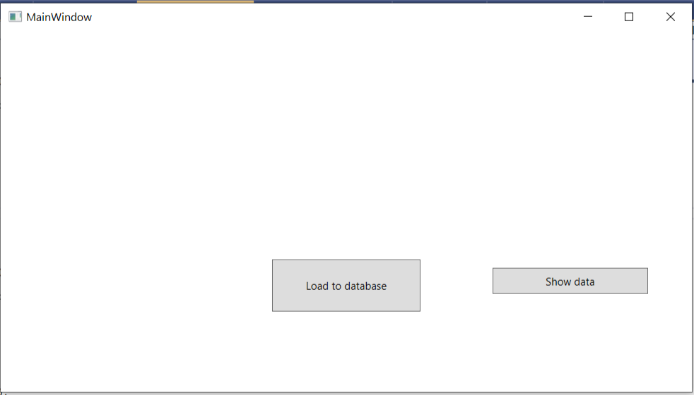
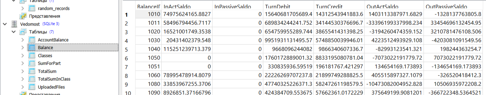
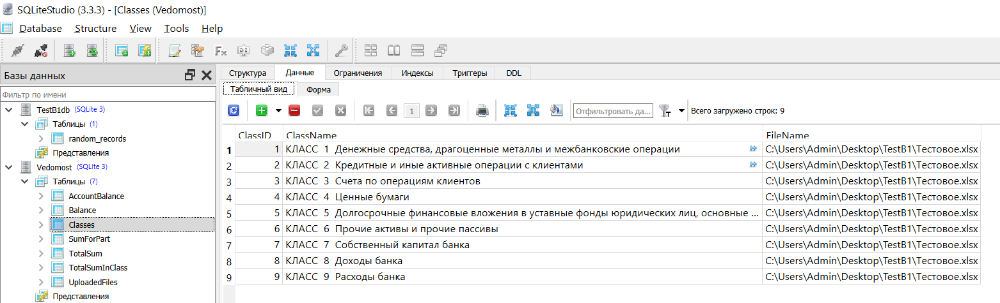
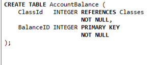
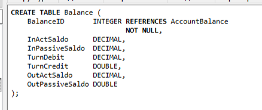
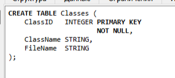
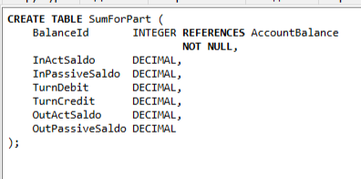
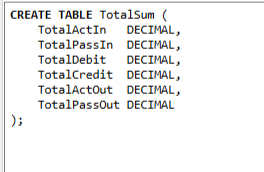
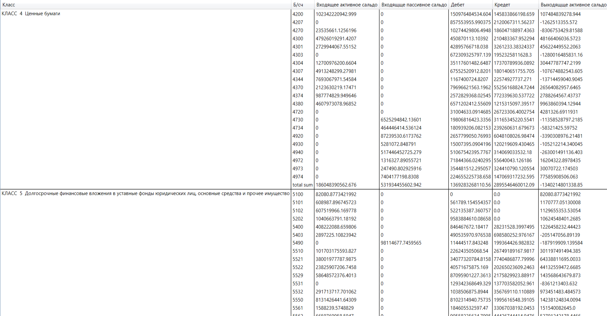
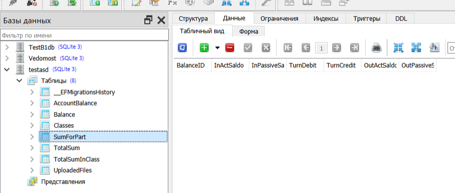

# Задание 2
## использовался Sqlite
- Окно при старте. 

- Нажимаем Load to database. Строка подключения и путь к файлу указаны в коде. Результат загрузки в базу данных:

- Структуры таблиц.

- При нажатии на кнопку ShowData после загрузки в базу данных появляется окно с данными

- Результат создания базы данных с помощью миграций

